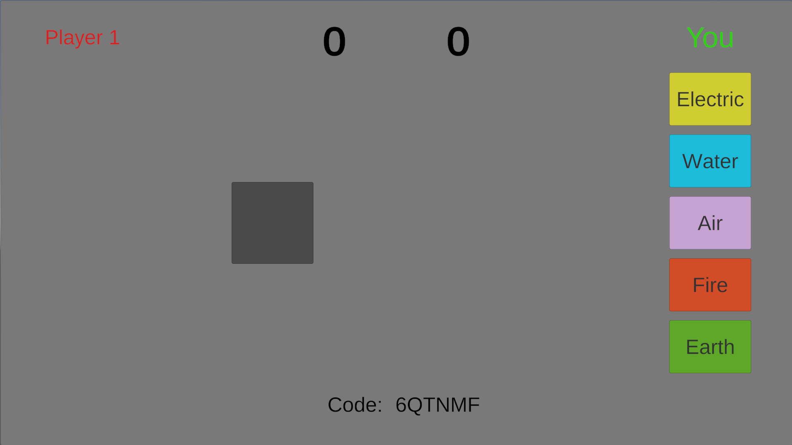
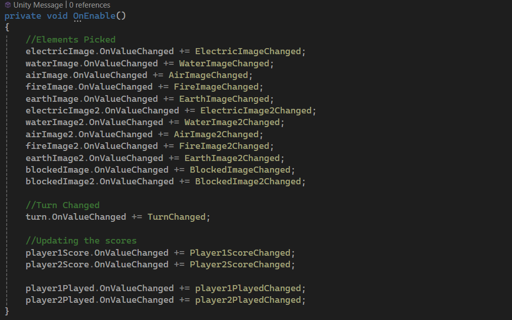
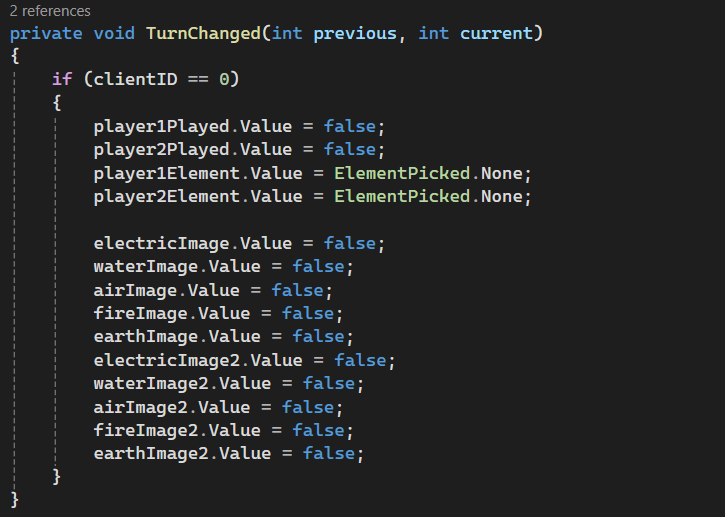
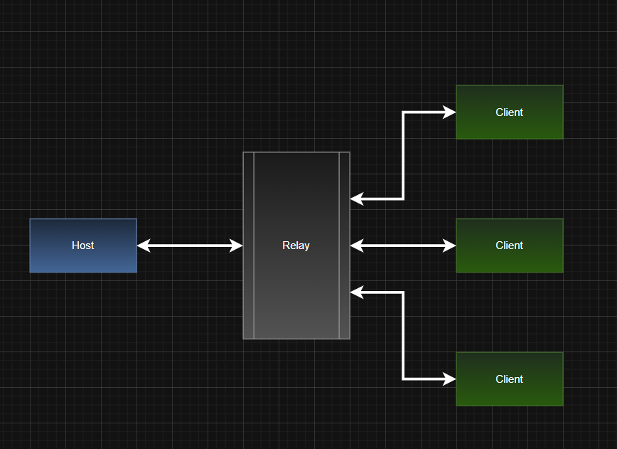
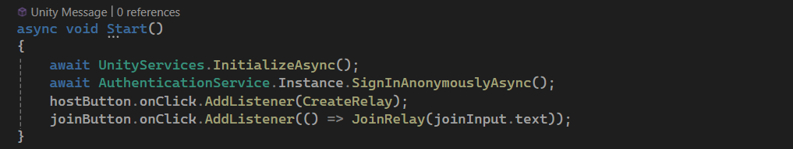
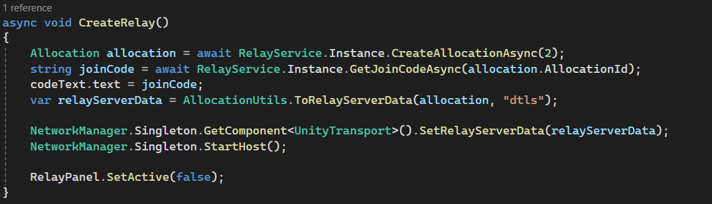
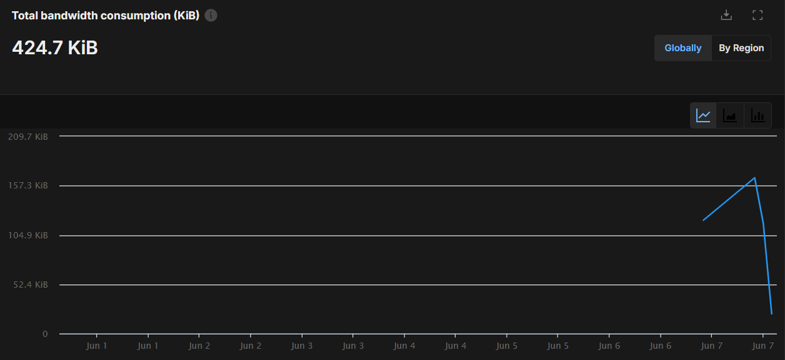
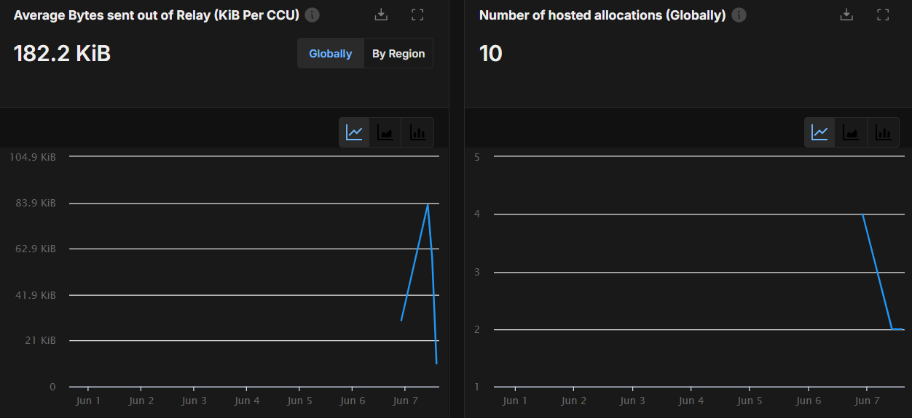
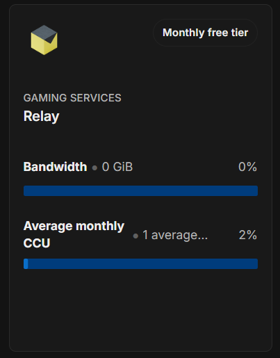

# Multiplayer Turn Based Game

## **Gonçalo Sampaio | 22400599**

## Introduction ##

This is a turn based game similar to rock, paper, scissors. It uses 5 elements instead of the traditional 3 possible choices.

To implement the multiplayer functionality, I'm using the Unity Netcode for GameObjects package and the Unity Relay package, by connecting the project to Unity's Cloud Services.

## Technical Description ##

### Gameplay ###

Upon starting the game, the player will see the following screen:

The first player should press the "Host" button.
This will take them to the game screen with the code for the other player to connect to the same game.

The host then shares this code with the other player and the player inserts thats code on the text box.

When the client writes the correct code and presses the "Client" button, they will connect to the host's game and now they can play together.

Now, the game has started and players can pick their element for that turn.
Upon picking an element, it will show everyone that that player already made their choice, without revealing what element was picked.
The buttons are also locked to prevent changes until the end of the turn.

Now the other player also needs to make his choice.
The order of picking is irrelevant but the turn will only end when both players make their choice.
When both players make their choice, the elements are revealed to everyone and compared to decide who won that turn, getting 1 point.

After that, the turn changes, allowing players to make a choice again.

The element system works in a cyclic way:

- Each element is strong against the 2 elements after it.
- Each element is weak against the 2 elements before it.
- Picking the same element will result in a draw and players don't get any points.

The game goes on until one of the players reaches 10 points, ending the game.

### Unity Implementation ###

Most of the game is controlled on the host's side, with the exception of certain objects that have different behaviors for each player.

In terms of relevant objects we have the following:

- NetworkManager: Has the Network Manager component and the Unity Transport component. It is needed to setup network settings and to start the host and the client and manages overall communication between them.
- Canvas: has all the UI Elements needed for the game and has the UI Manager component that handles their behavior along with the game's behavior.

    - The UI Manager component has to inherit from the NetworkBehavior class.

    - This along with the fact that the Canvas object has a Network Object component, allows our code to interact with netcode.

- RelayManager: Has the RelayManager script that takes care of creating a Relay and connecting the Host and the Client.
- RuntimeNetworkStatsMonitor: Has the RuntimeNetStatsMonitor component, used only for debug purposed: to check if the connections are being successful and to evaluate how much data is being sent between the client and the host.

For the game behavior, I had to create a lot of Network Variables in order to track and synchronize certain properties between the host and the client.

The OnNetworkSpawn method is called when the network is set and the player connects as a host or a client.

The host will have the clientID 0 because they were the first to connect and the client will have the clientID 1.
I used these IDs to enable or disable the opposing player's buttons along with some UI objects to better indicate who the player is.

When pressing the element buttons, each will call the corresponding element method.

Then the DisableImagesRpc method gets called but is only executed on the server, in this case, on the host's side.

If it gets called by the host, it will disable the hosts picked element and enable only the right one, also enabling the grey square that hides it until both players pick their elements.

If it gets called by the client, it will tell the host to do the same, but for the client's elements.

The PickElementRpc method is also called. But again, its only executed on the host's side.

This method will set the values of the element picked by each player and if that player already picked an element on that turn.

It also disables the buttons of player that picked an element.

Finally, the SolveTurnRpc method also gets called.
If both players already picked an element, it removes the grey squares hiding the picked elements, and calls the CompareChoices method that will decide who won the round, depending on the elements picked by each player.

CompareChoices method also checks if any player already reached 10 points and if they didn't, it starts a coroutine to show give some time to the players to see the results before increasing the turn.

If any player reaches 10 points, the FinishGameRpc method gets called by the host, since only the host runs the CompareChoices method.
FinishGameRpc will be executed by everyone, to show each player the corresponding result.

To handle all the changes on the Network Variables and change the corresponding objects accordingly, I'm using events to call the correct methods when the value of the Network Variables changes.
This allows each player to have their game react and change depending on the properties, to show the correct game state.

When the NetworkVariable for the turn changes, it resets the necessary NetworkVariables. This can only be done if its done by the host, since only the host has permissions to change them.

### Relay ###

The Relay is an intermediary server that when the host and the clients connect to, creates a connection between them without the need to share the host's IP. This is used for an easy and more secure peer-to-peer connection.

Unity provides this service for free up to a certain threshold. But for small projects, its more than enough.

#### **Network architecture diagram** ####

To use the relay service, we need to initialize the Unity Services and sign in with the AuthenticationService.

To create a relay we start by creating an allocation with the RelayService and passing a parameter that represents the possible number of connections.
In this case we only need 2.

Then to get the join code, we use the RelayServices to get it by passing the allocationId.

Then to set the relay data on the Network Manager, we create a new RelayServerData passing the allocation as a parameter and set that relay data.

And start the Host with the correct Data.

To join the Relay, we use the provided code to get the allocation and then use that allocation to get the RelayServerData, setting that data in the client's NetworkManager.

And start the Client with the correct Data.

Then the client and the host will be connected and can play together.

## Bandwidth Evaluation ##

Using Unity's Cloud Services also allows us to check on different statistics regarding each specific service.

After finishing the project's development and playing a couple of times, we can see that the total bandwidth consumption was only 424.7 KiB in 10 tests, from which 4 were complete matches and not just testing.

We can also check that the bandwidth used for this 10 tests, along with the number of concurrent users expected for this project, doesn't reach at all the maximum allowed for free by Unity.

This means that, for small projects like this, Unity's Relay Service is more than enough.

## Bibliography ##

Relay: https://www.youtube.com/watch?v=fRJlb4t_TXc&ab_channel=Rootbin

Unity Documentation:

- https://docs-multiplayer.unity3d.com/netcode/current/components/networkmanager/
- https://docs-multiplayer.unity3d.com/netcode/current/basics/networkvariable/index.html
- https://docs-multiplayer.unity3d.com/netcode/current/basics/networkobject/
- https://docs-multiplayer.unity3d.com/netcode/current/advanced-topics/message-system/rpc/

Others: https://www.youtube.com/watch?v=YmUnXsOp_t0&t=10020s&ab_channel=CodeMonkey